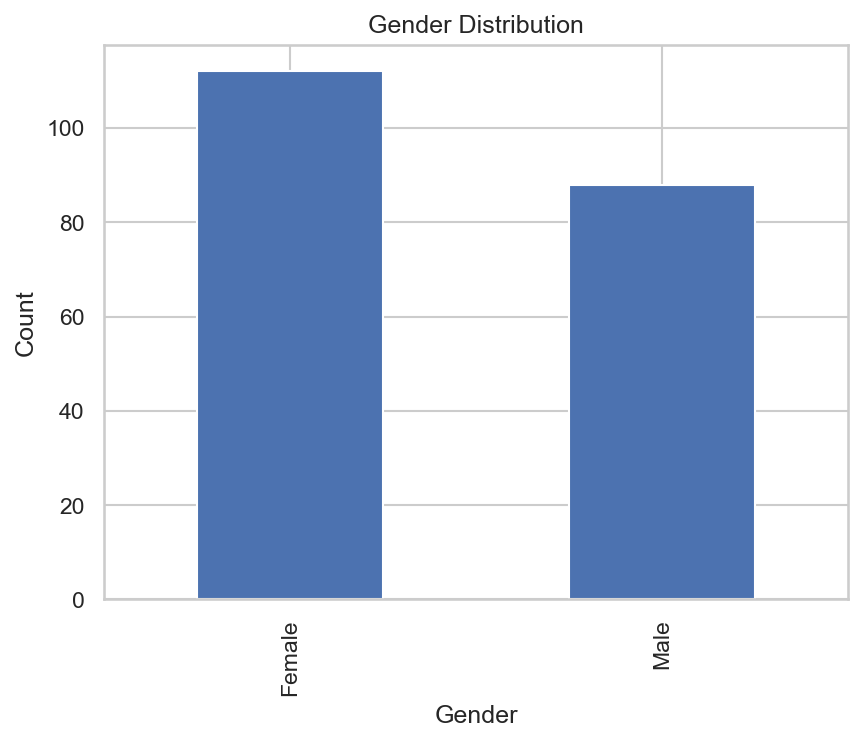
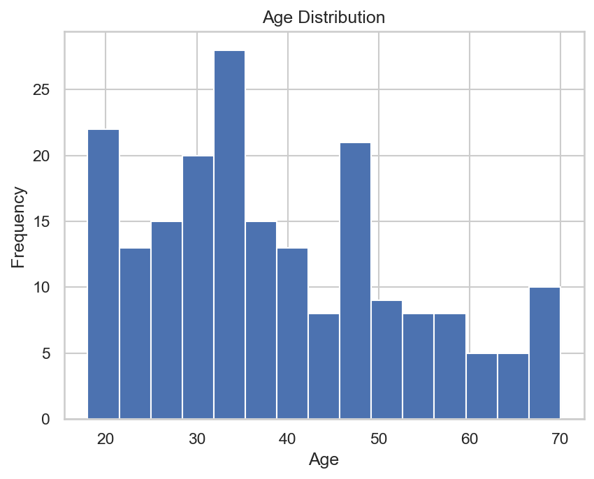
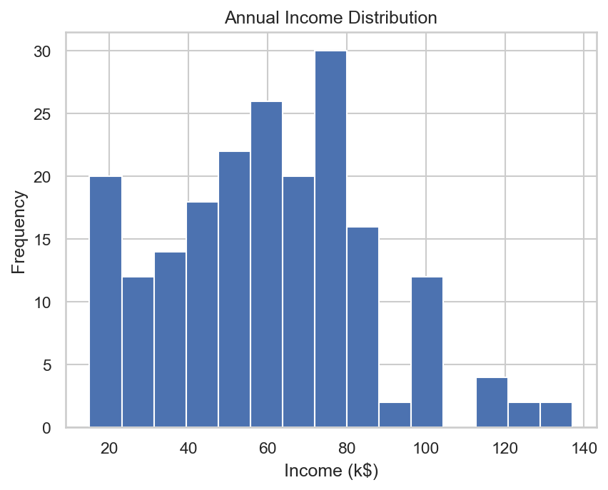
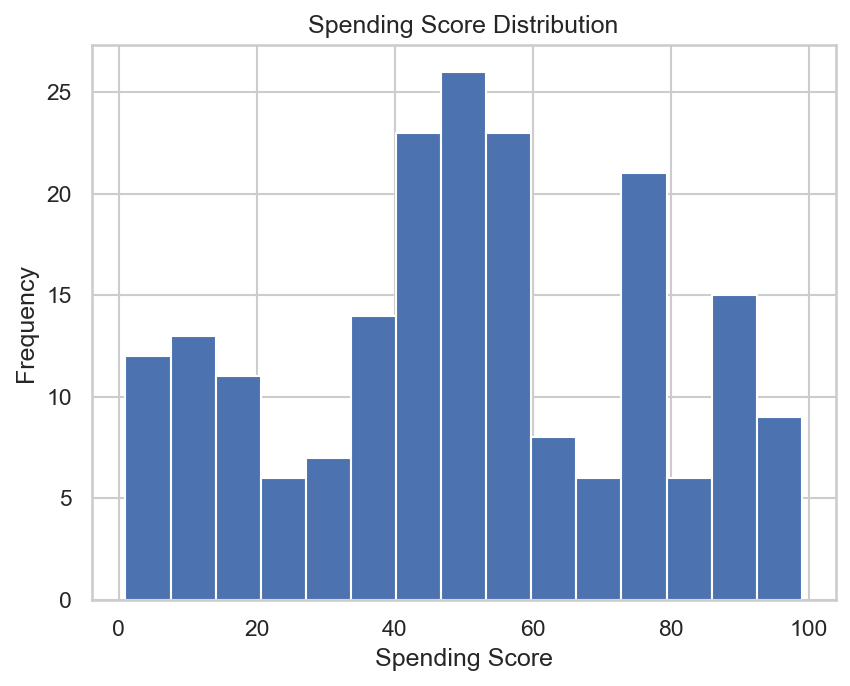
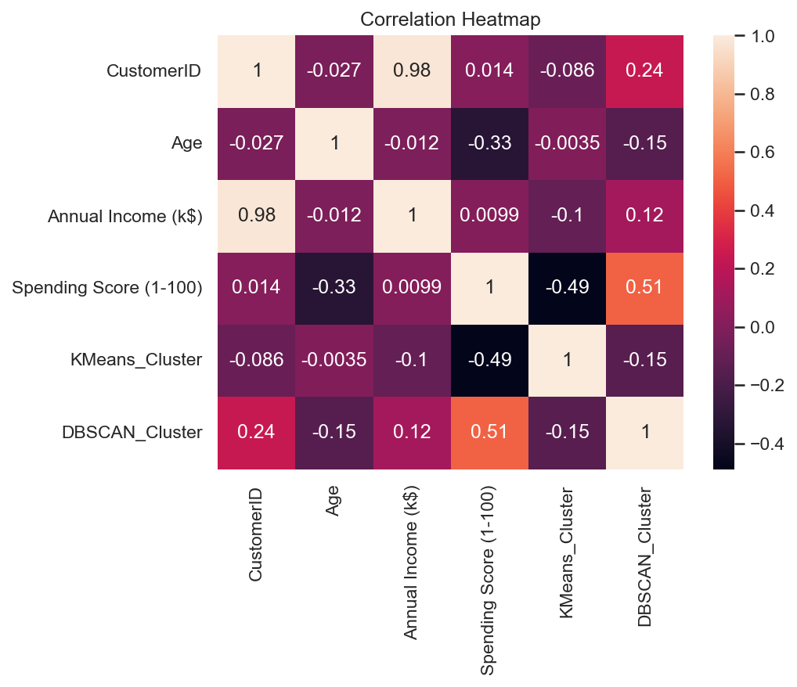
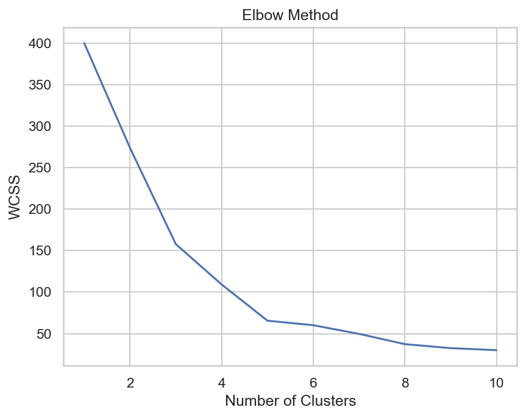
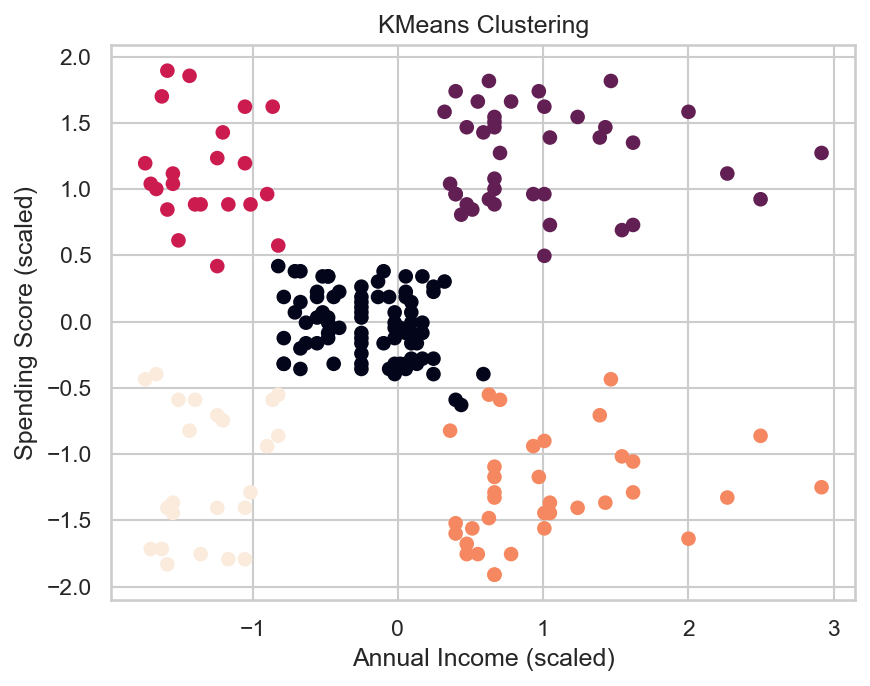
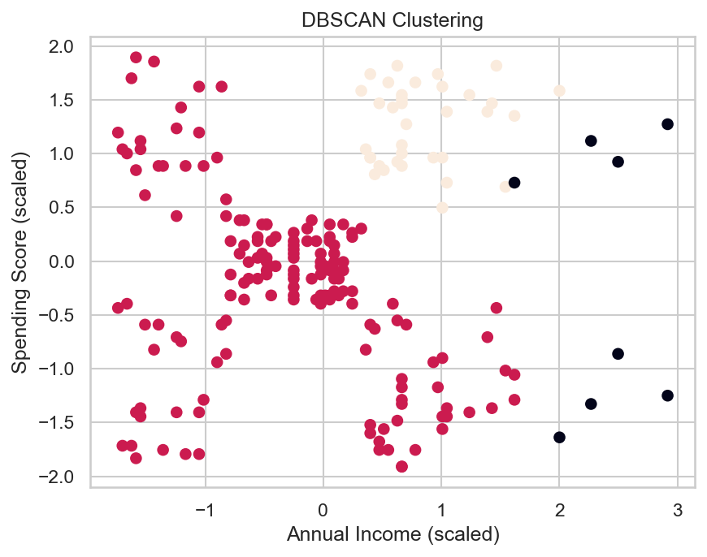
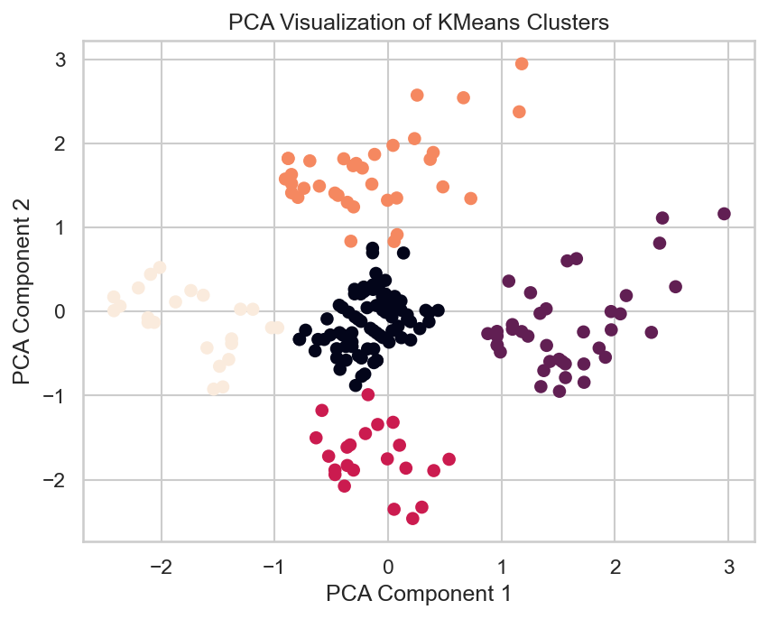

# Customer Segmentation Analytics

## 📌 Objective

This project performs **customer segmentation** on mall customer data using unsupervised machine learning algorithms. The goal is to identify distinct customer groups based on their purchasing behavior, enabling targeted marketing strategies.

## Dataset Description

**Source:** [Mall Customers Dataset (Kaggle)](https://www.kaggle.com/datasets/vjchoudhary7/customer-segmentation-tutorial-in-python)  
**Records:** 200 customers  
**Features:**

| Feature | Description |
|---------|-------------|
| CustomerID | Unique identifier for each customer |
| Gender | Male / Female |
| Age | Customer age in years |
| Annual Income (k$) | Annual income in thousands of dollars |
| Spending Score (1-100) | Score assigned based on spending behavior |

## Algorithms Used

1. **K-Means Clustering**
   - Partitioning method to group customers into K clusters
   - Used Elbow Method to determine optimal K (K=5)
   - Silhouette Score for validation

2. **DBSCAN (Density-Based Spatial Clustering)**
   - Density-based clustering to identify arbitrary shaped clusters
   - Automatically detects noise points/outliers

3. **PCA (Principal Component Analysis)**
   - Dimensionality reduction for visualization
   - 2D projection of clustered data

##  Results

| Algorithm | Silhouette Score |
|-----------|------------------|
| K-Means (K=5) | ~0.55 |
| DBSCAN | Varies based on parameters |

### Customer Segments Identified:
- **High Income, High Spending** - Premium customers
- **High Income, Low Spending** - Potential targets for marketing
- **Low Income, High Spending** - Impulsive buyers
- **Low Income, Low Spending** - Budget-conscious customers
- **Average Income, Average Spending** - Standard customers

## Sample Visualizations

### Gender Distribution


### Age Distribution


### Annual Income Distribution


### Spending Score Distribution


### Correlation Heatmap


### Elbow Method for Optimal K


### K-Means Clustering Results


### DBSCAN Clustering Results


### PCA Visualization


##  Technologies Used

- Python 3.x
- Pandas
- NumPy
- Matplotlib
- Seaborn
- Scikit-learn

##  How to Run

1. **Clone the repository**
   ```bash
   git clone https://github.com/yourusername/Customer-Segmentation-Analytics.git
   cd Customer-Segmentation-Analytics
   ```

2. **Install dependencies**
   ```bash
   pip install -r requirements.txt
   ```

3. **Run the Jupyter Notebook**
   ```bash
   jupyter notebook notebooks/analysis.ipynb
   ```

##  Project Structure

```
Customer-Segmentation-Analytics/
├── Data/
│   └── Mall_Customers.csv
├── notebooks/
│   └── analysis.ipynb
├── images/
│   ├── gender_distribution.png
│   ├── age_distribution.png
│   ├── income_distribution.png
│   ├── spending_distribution.png
│   ├── correlation_heatmap.png
│   ├── elbow_method.png
│   ├── kmeans_clustering.png
│   ├── dbscan_clustering.png
│   └── pca_visualization.png
├── README.md
├── requirements.txt
└── .gitignore
```

## License

This project is for educational purposes.

## Author

Abijith Raja B
